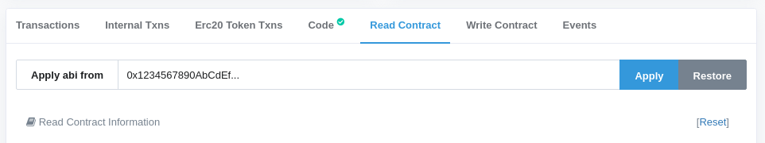

# Apply ABI on Etherscan
UserScript that adds an option to use ABI from a different contract to etherscan's Read Contract/Write Contract panes.

Useful when there's need to interact with a Proxy contract -- apply to it ABI from the Proxied implementation contract and make calls as if the Proxy was initialized as 

```js
new web3.eth.Contract(Proxied.abi, Proxy.address)
```



## License

Licensed under the MIT license.
